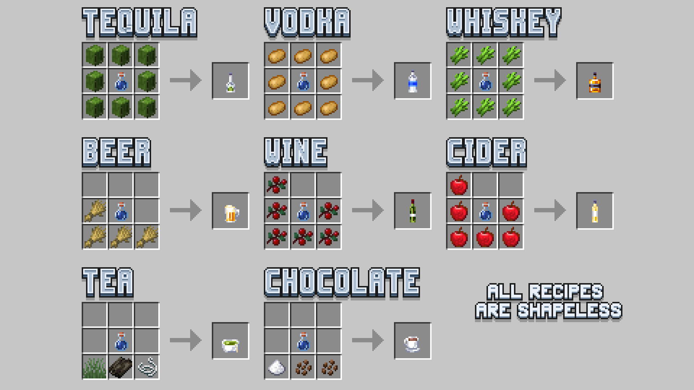

A datapack adding 8 new drinks with various effects and an alcohol mechanic. 
**This datapack requires a resource pack to work.**

## Recipes

## Installation
1. Download the datapack & resource pack from the ["Releases"](https://github.com/Geegaz-Datapacks/GGDK/releases) tab of the repository.
2. Place the datapack in the `datapacks` folder of your world
3. Place the resource pack in the `resourcepacks` folder of minecraft

## Contributing
You can help translating the datapacks by adding your language to this [Google Sheet](https://docs.google.com/spreadsheets/d/144mhHsIzvqovH30cmGMgiHWHP_Fb4huwsOg8bK4EghE/edit?gid=0#gid=0).

You can report issues in the ["Issues"](https://github.com/Geegaz-Datapacks/GGDK/issues) tab of the repository. Check if your issue has already been reported, and if not create a new one:
1. Give your issue a descriptive name
2. Indicate your minecraft version and your software (vanilla, modded, plugins...)
3. Explain what doesn't work and how you expected it to work
4. If needed add logs, screenshots and videos

## License
See the `src` folder for the licenses of the datapack & resource pack