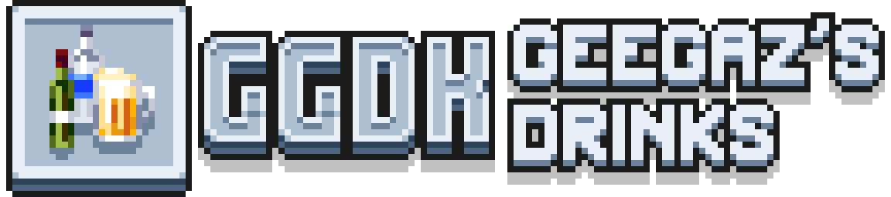

A datapack adding 8 new drinks with various effects and an alcohol mechanic. 
**This datapack requires a resource pack to work.**

## Recipes
Take a bottle of water and add:
- **Tequila:** Cactus ×8
- **Vodka:** Potato ×8
- **Whiskey:** Sugar Cane ×8
- **Beer:** Wheat ×4
- **Wine:** Sweet Berries ×6
- **Cider:** Apple ×6
- **Tea:** Short Grass ×1, Dried Kelp ×1, String ×1
- **Chocolate:** Sugar ×1, Cocoa Beans ×2

**All recipes are shapeless**

## Alcohol
All drinks in the pack will give you an effect based on the type of drink they are:
- **Tequila, Vodka, Whiskey:** Resistance II 2:30, Strengh II 2:30
- **Beer:** Saturation
- **Wine:** Instant Health
- **Cider:** Absorption 0:30
- **Tea, Chocolate:** Regeneration 0:20

Alcoholic drinks are indicated by a percentage under their name. Drinking them will raise your alcohol level, slowly making you drunk. You will get negative effects based on how drunk you are, and might eventually black out and die if you keep drinking. **The only way to stop these effects is to wait it out.**

You can disable negative effects, change the speed at which you get drunk or sober up and change the effect thresholds by using the command `/scoreboard players set $ggdk.<gamerule> ggdk.gamerule <value>` with these gamerules available:
- `do_drunkness`: 1 (default) to enable negative effects, 0 to disable them
- `consume_speed`: 8 (default), how fast you get drunk after drinking alcohol
- `sober_speed`: 2 (default), how fast you sober up when getting drunk
- `level_1`: 210 (default), threshold for light drunkness effects
- `level_2`: 420 (default), threshold for medium drunkness effects
- `level_3`: 540 (default), threshold for heavy drunkness effects
- `level_death`: 800 (default), threshold for blackout and death

After changing the gamerules, use `/function ggdk:gamerule/save` to ensure the gamerules are saved between reloads. Use `/function ggdk:gamerule/reset` to reset the gamerules to their original values.

## Installation
1. Download the datapack & resource pack from the ["Releases"](https://github.com/Geegaz-Datapacks/GGDK/releases) tab of the repository.
2. Place the datapack in the `datapacks` folder of your world
3. Place the resource pack in the `resourcepacks` folder of minecraft

For more info, see [this post from Planet Minecraft](https://www.planetminecraft.com/blog/how-to-download-and-install-minecraft-data-packs/) on how to install datapacks.

## Contributing
You can help translating the datapacks by adding your language to this [Google Sheet](https://docs.google.com/spreadsheets/d/144mhHsIzvqovH30cmGMgiHWHP_Fb4huwsOg8bK4EghE/edit?gid=0#gid=0).

You can report issues in the ["Issues"](https://github.com/Geegaz-Datapacks/GGDK/issues) tab of the repository. Check if your issue has already been reported, and if not create a new one:
1. Give your issue a descriptive name
2. Indicate your minecraft version and your software (vanilla, modded, plugins...)
3. Explain what doesn't work and how you expected it to work
4. If needed add logs, screenshots and videos

## License
See the `src` folder for the licenses of the datapack & resource pack